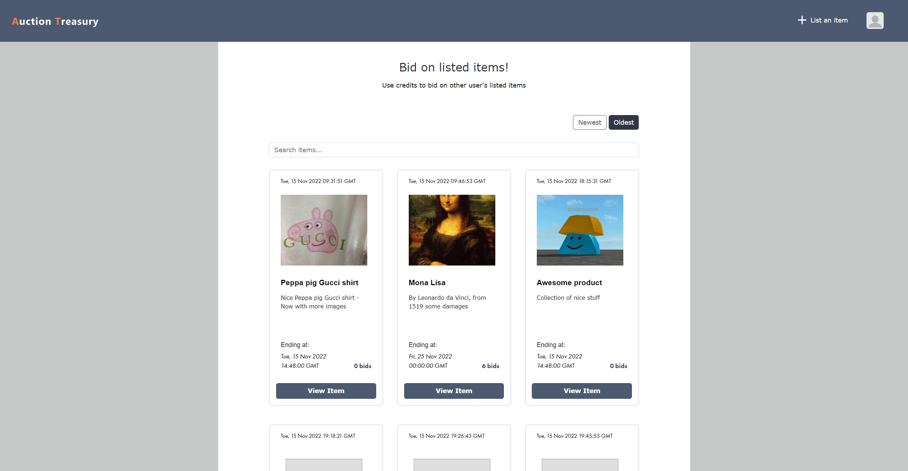

# Auction Treasury (semester-project-2)

This is a semester project made for my FrontEnd development studies. The concept for this website is an auction website for selling and buying all kinds of items. Hope you find that the website gets you inspired.

## Description

- The aim for this website is to let you bid on auctioned items.
- You can register a user and list your own items for auction.
- The demographic this website is targeting are all people, young and old, who would like to buy/bid on desired items, and/or list items for auction.

## Built With

- HTML
- CSS
- Bootstrap v5.2.0
- SASS/SCSS
- Javascript
- Noroff API
- Visual Studio Code

## Getting Started

### Installing

First make sure Node.js and git is installed locally on your device.

Install devDependencies:

<pre>
- npm i
</pre>

### Running

Apply Styling by compiling from scss to css. Use:

<pre>
- npm run build
</pre>

or

<pre>
- npm run watch
</pre>

Update what files prettier and eslint are targeting to suit your needs (scripts in package.json):

<pre>
"format": "prettier -w \_/.js",
"lint": "eslint \_/.js",
"lint-fix": "eslint \*/.js --cache --fix",
</pre>

Configured for hosting with Vite. Use:

<pre>
- npm run dev
</pre>

## For Testers

Unit tests can be written with Jest. Name your files using this format: "example.test.js".
Run your tests with:

<pre>
- npm run test-unit
</pre>

End-to-end tests can be written with Cypress. Run your tests with:

<pre>
- npm run test-e2e
</pre>

or

<pre>
- npm run test-e2e-cli
</pre>

## Website Link

https://auctiontreasury.netlify.app

## Contact

https://www.linkedin.com/in/stian-dille-kornbakk-335b5a159/
